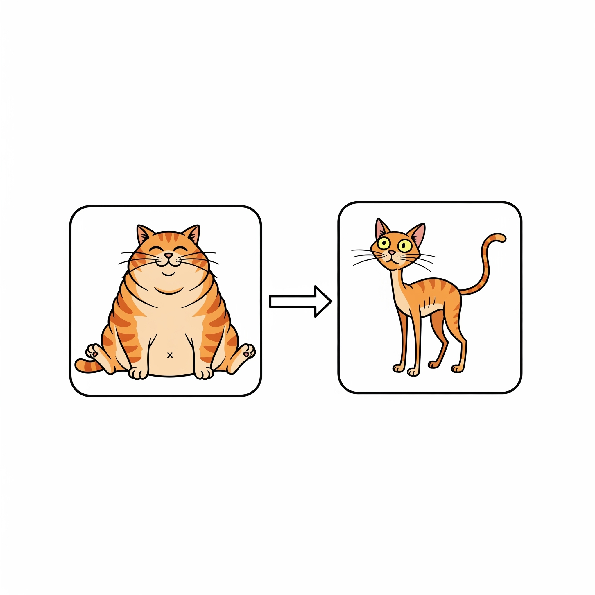

<h1 align="center">Chonker-Chopper</h1>

<div align="center">
  
</div>


A Laravel application with Docker Sail integration for development. 
This project includes an API with a handful of endpoints for uploading CSVs of long URLs to shorten them. Other endpoints provide data for client analysis and output.
It also has a full MVC website for uploading CSV files containing URLs to be shortened, along with an API for managing and retrieving shortened URLs and their analytics.
Finally, it includes a small suite of Unit and Feature tests to ensure the core functionality works as expected.
I've pushed up this project to GitHub as a public repo for anyone to use, modify, and learn from. This also will give you insight into my coding style, git habits, and other practices.

If you happen to be a Linux user, I've included a small script `sail-fixs.sh` to help with some common permission issues that can arise when using Sail on Linux systems. Just run it before starting Sail for the first time. 
Further instructions are provided below.

Note: This project is for educational purposes only and is not intended for production use.

## Prerequisites
- PHP 8.2+
- Composer
- Node.js 20.17+
- NPM 10.3+
- Docker Desktop
- Docker Compose
- Git 

## Installation & Setup

### Option 1. Clone Repository 
```bash
git clone https://github.com/unsubstantiated-Script/chonker-chopper
cd chonker-chopper
```

### Option 2. Unzip Repository
```bash
unzip chonker-chopper.zip
cd chonker-chopper
```

### 2. Install Dependencies
```bash
composer install
```

### 3. Environment Setup (Only needed for Git clone)
```bash
cp .env.example .env
php artisan key:generate
```
- Update `.env` file with your database credentials

### 4a. Start Laravel Sail (MAC/Windows)
```bash
./vendor/bin/sail build --no-cache
./vendor/bin/sail up -d
```
> **Important Note:**
> If you encounter port issues with 3306 and/or 80 you can either:
> 1. Change the port in your `.env` file to an available port:
> ```dotenv
> DB_PORT=3307
> FORWARD_DB_PORT=3307
> APP_PORT=8080
> FORWARD_APP_PORT=8080
>```
> Or...
>
> 2. Stop any services using those ports (e.g., MySQL and/or Apache2)
> ```bash
> sudo systemctl stop mysql
> sudo systemctl stop apache2
> ```

### 4b. Start Laravel Sail (Linux)
```bash
./sail-fixs.sh
./vendor/bin/sail up -d
sudo chmod -R 777 storage bootstrap/cache
```


### 5. Database Migration (Wait a moment to run this one)
```bash
./vendor/bin/sail artisan migrate
```

### 6a. Install/Run Node Packages for Frontend (MAC/Windows)
```bash
./vendor/bin/sail npm install
# Then start the dev server
./vendor/bin/sail npm run dev
```

### 6a. Install/Run Node Packages for Frontend (Linux)
```bash
./vendor/bin/sail exec -u root laravel.test npm install
# Then start the dev server
./vendor/bin/sail exec -u root laravel.test npm run dev
```


## Development URLs
- **Application**: http://localhost

> **Important Note:** to make PostMan setup easier, I've included `Chonker_Chopper_API.postman_collection.json` setup exports in the root of this directory.
> Simply import it into PostMan and you're good to go for API endpoint testing!

## API Routes
- `GET /api/v1/urls` - List all URLs
- `POST /api/v1/urls/upload` - Upload CSV file with URLs
- `GET /api/v1/urls/analytics` - Get all analytics in batches
- `GET /api/v1/urls/{shortUrl}` - Get URL data for a specific shortened URL
- `GET /api/v1/urls/{shortUrl}/analytics` - Get analytics for a specific short URL

### Uploading CSV File in Postman
1. Set request method to `POST`
2. Set URL to `http://localhost/api/v1/urls/upload`
3. Go to **Body** tab
4. Select **form-data**
5. Add key `csv_file` with type set to **File**
6. Click **Choose Files** and select your CSV file
7. Ensure CSV format: each row should contain a URL (seem sample urls_2_test.csv provided in root of this project)
8. Click **Send** to upload

## Blade Templates
- `layouts/app.blade.php` - Main application layout with navigation
- `urls/create.blade.php` - URL shortener upload page with CSV drag-and-drop
- `urls/index.blade.php` - View shortened URLs organized by batches
- `urls/analytics.blade.php` - Analytics dashboard showing click data
- `components/alert.blade.php` - Success/error message component
- `components/url-card.blade.php` - Individual URL display card
- `components/stats-card.blade.php` - Statistics display component
- `errors/404.blade.php` - Custom 404 error page

## Development Commands

### Sail Commands
```bash
./vendor/bin/sail up -d          # Start containers
./vendor/bin/sail down           # Stop containers
./vendor/bin/sail shell          # Access container shell
./vendor/bin/sail artisan <cmd>  # Run artisan commands
```

### Frontend Commands
Normies
```bash
./vendor/bin/sail npm run dev    # Development server
./vendor/bin/sail npm run build  # Production build
./vendor/bin/sail npm run watch  # Watch for changes
```
Linux User in the Docker Shell
```bash
./vendor/bin/sail exec -u root laravel.test npm run dev
./vendor/bin/sail exec -u root laravel.test npm run build
./vendor/bin/sail exec -u root laravel.test npm run watch
```

### Testing
```bash
./vendor/bin/sail artisan test --testsuite Unit
```

## Database Configuration
- **Database**: `chonker_chopper`
- **Host**: `mysql` (Docker network)
- **Port**: `3306`

## Troubleshooting
```bash
# Clear caches
./vendor/bin/sail artisan config:clear
./vendor/bin/sail artisan cache:clear
./vendor/bin/sail artisan view:clear

# Fix permissions
./vendor/bin/sail artisan storage:link
```
